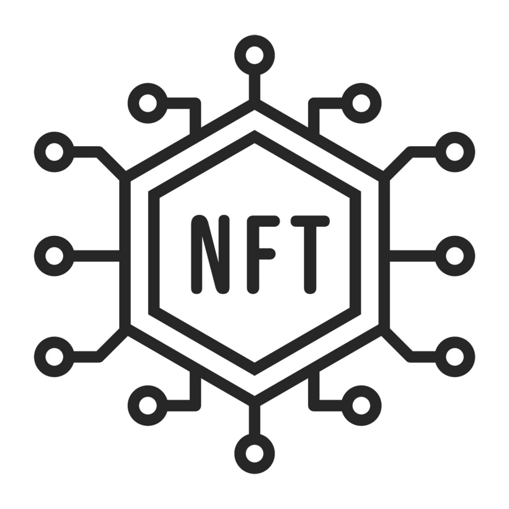

 

  <h1 align="center">NFT</h1>

  

     
    <a href="https://sepolia.etherscan.io/address/0x5ad32c033983b00e7367eb19230db467158cf4dc"><strong>Contracts on the blockchain</strong></a>
     
     
    <a href="./assets/Progetto Ethereum Advanced di Samuele Furnari.pdf">Presentation IT</a>
  

## Introduction

Welcome to the Decentralized News & Articles (DnA) project! This repository contains the implementation of a smart contract for creating and distributing exclusive editorial and digital content using Ethereum blockchain and NFTs (Non-Fungible Tokens). Through the utilization of Chainlink VRF (Verifiable Random Function) and OpenZeppelin, DnA ensures the authenticity and integrity of its content, providing users with access to verified and authentic information. DnA leverages the Ethereum blockchain to tokenize editorial and digital content, ensuring its authenticity and preventing the dissemination of false or manipulated information. Each article or video produced by DnA is represented as a unique NFT, containing information about its authenticity, metadata, and the digital signature of the author.

## About my choise

1. **AuthenticityToken.sol**: The AuthenticityToken contract forms the core of the DnA project, managing the creation, management, and authentication of NFTs for every article or video published on the platform. This contract implements the logic for generating reliable random numbers using Chainlink VRF, assigning metadata to NFTs, and checking the authenticity of the content. By leveraging Chainlink VRF, the contract ensures that the randomness used in various operations, is secure and verifiable. Additionally, AuthenticityToken handles the rewards system for users who actively contribute to the platform, incentivizing participation and engagement.
3. **Chainlink VRF Integration**: To ensure the randomness and integrity of certain operations within the platform, AuthenticityToken integrates Chainlink VRF. This integration enables the platform to generate secure and verifiable random numbers, which are crucial for functions such as content curation and reward distribution. By leveraging Chainlink VRF, the platform can guarantee that the randomness used in these operations is tamper-proof and cannot be manipulated, ensuring fairness and transparency in the platform's operations.
4. **OpenZeppelin (ERC721 Contract Integration)**: AuthenticityToken leverages OpenZeppelin libraries to integrate the ERC721 standard into its contracts. This integration enables the creation and management of NFTs (Non-Fungible Tokens) compliant with the ERC721 standard. By adhering to this standard, NFTs created by AuthenticityToken exhibit characteristics such as uniqueness, indivisibility, and interoperability with other platforms and applications that support the ERC721 standard. This ensures that NFTs created on the DnA platform can be securely owned, traded, and interacted with across various decentralized applications and marketplaces, enhancing their utility and value proposition.

## About deployment

The information you can see in the hardhat.config file will not be correct for the compiler in your local enviroment. This is because the "cred" file was only present in the distribution. This sensitive file will not be present in the GitHub repository, so before running any command:

1. **Comment**: import { INFURA_API_KEY, ETHERSCAN_API, PRIVATE_KEY } from "./cred"
2. **Comment**: From the "networks" to "etherscan" properties of the HardhatUserConfig object
3. **Important**: Do not comment the solidity version

**_Before running the "npx hardhat test" or "npx hardhat compile"_**

## Installation

To install and run this project locally, follow these steps:

1. Clone this repository: `git clone https://github.com/samuelefrni/NFT`
2. Navigate to the project directory
3. Install dependencies: `npm install`
4. Compile contracts: `npx hardhat compile`
5. Run tests: `npx hardhat test`

## About testing

To test the Chainlink VRF, i had to create two differnt AuthenticityToken smart contract. I followed these steps:

1. **Deployment of the VRFCoordinatorV2Mock contract**: Firstly, I deployed the VRFCoordinatorV2Mock contract. During deployment, I set the parameters _baseFee and _GASPRICELINK required for the Chainlink VRF operation.
2. **Deployment of the AuthenticityTokenTesting contract**: Subsequently, I deployed the AuthenticityTokenTesting contract. This contract was configured with specific arguments to enable testing in a local environment.
3. **Execution of tests**: Once both contracts were successfully deployed, I executed a series of tests to verify the proper functioning of the Chainlink VRF functionality. During the tests, I simulated various situations and scenarios to ensure that the generation of random numbers was secure and verifiable.
4. **Verification of results**: After running the tests, I verified the results to ensure that the Chainlink VRF functionality worked as expected. In particular, I checked the correctness of the generated random numbers and confirmed that they were consistent with expectations.
5. **Error handling**: In case any errors occurred during the test execution, I identified the causes and made the necessary corrections to resolve them. Special attention was given to error handling to ensure the robustness and reliability of the system.

### Important

After installing the dependencies, is crucial for the testing purpose to change the visibility of the "s_currentSubId" in line 59 to public in the "VRFCoordinatorV2Mock.sol". 

### How to reach that contract

**_Before running the "npx hardhat test" or "npx hardhat compile"_**

## Contributing

Contributions are welcome! Feel free to open issues or submit pull requests.

## License

This project is licensed under the [MIT License](https://opensource.org/licenses/MIT).

## Author

- **Samuele Furnari**
  - Email: samuelefurnari9@gmail.com
  - GitHub: [samuelefrni](https://github.com/samuelefrni)
  - LinkedIn: [Samuele Furnari](https://www.linkedin.com/in/samuele-furnari-a37567220/)
